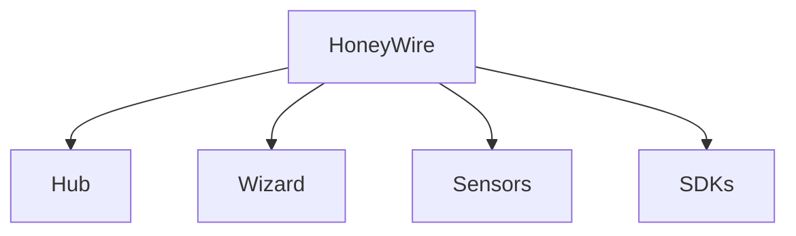
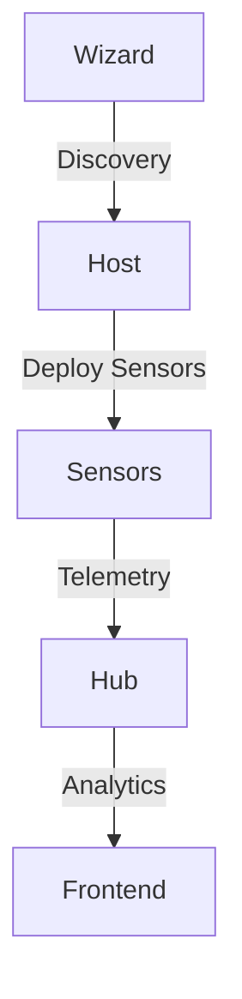
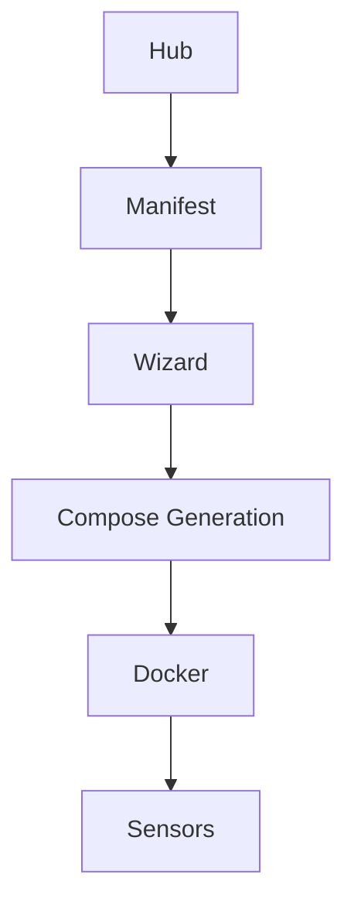
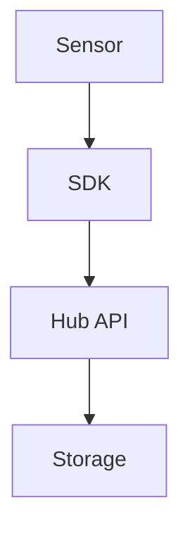
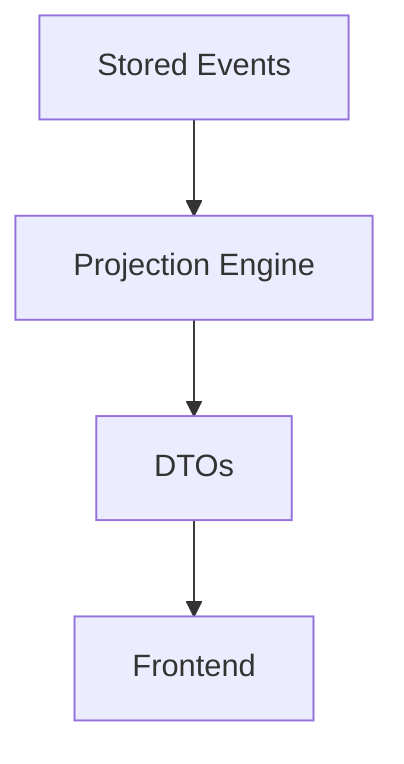
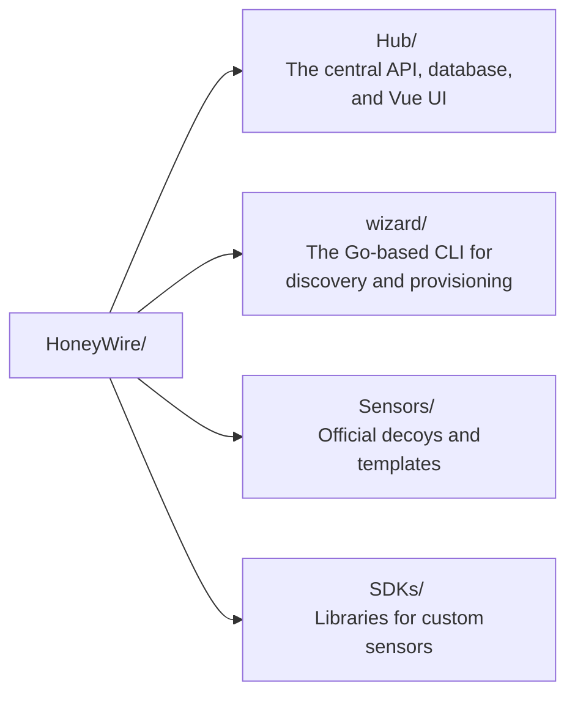
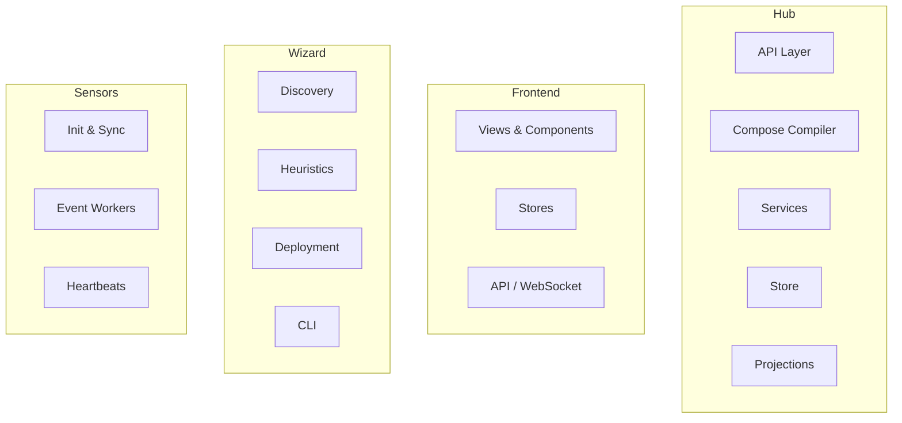

# HoneyWire Architecture Overview

## Purpose

HoneyWire is a distributed deception platform composed of:

- A central management Hub
- A deployment and discovery Wizard
- Containerized Sensors
- Language SDKs

The system is designed around **centralized visibility and decentralized execution**.

---

## Major Components

HoneyWire is separated into four primary components. 

### [Hub](/Docs/architecture/hub/)
The central orchestrator and data aggregator. 
*For deep-dives into the Hub, see the [Backend Architecture](/Docs/architecture/hub/backend/README.md), and [Frontend Architecture](/Docs/architecture/hub/frontend/README.md).*

**Responsibilities:**
- Stores events
- Stores node metadata
- Manages sensor manifests
- Generates deployment plans
- Provides UI
- Aggregates telemetry

### [Wizard](/Docs/architecture/wizard/)
The deployment and node provisioning engine.

**Responsibilities:**
- Discovers host services
- Evaluates sensor heuristics
- Builds deployment plans
- Applies Compose deployments
- Synchronizes node state

### [Sensors](/Docs/architecture/sensors/)
The individual decoy containers placed throughout the network.

**Responsibilities:**
- Generate telemetry
- Generate alerts
- Report health
- Emit heartbeats

### SDKs
Libraries for building custom community sensors.

**Responsibilities:**
- Standardize telemetry formatting
- Handle authentication with the Hub
- Provide robust event transport
- Reduce sensor boilerplate

---

## System Interaction Diagram

---

## Deployment Models

HoneyWire supports two distinct methods for deploying sensors, both resulting in the same containerized execution but offering different levels of control and automation:

### Wizard Deployment (Automated)
The Wizard CLI runs directly on the target host. It performs point-in-time discovery of running services, evaluates sensor heuristics, and communicates with the Hub to automatically generate and apply a customized Docker Compose deployment. This model is ideal for dynamic environments, rapid provisioning, and maximizing deception coverage without manual configuration.

### Manual Deployment (Static)
Users can bypass the Wizard entirely via the Hub UI. The dashboard allows users to browse the Sensor Store, select a specific decoy, and instantly generate a pre-configured `honeywire-compose.yml` snippet (injected with the correct Hub endpoint and Node keys). The user then manually drops this file onto the target host and runs `docker compose -f /opt/honeywire/sensors/honeywire-compose.yml -p honeywire up -d` (the wizard runs the same command under the hood). This model is ideal for strict change-control environments, highly customized deployments, or isolated networks where running an automated discovery tool is undesirable.

---

## Runtime Data Flows

Understanding the data flow across component boundaries is crucial for contributing to HoneyWire.

### Deployment Flow

### Telemetry Flow

### Analytics Flow
*See [Projections Architecture](/Docs/architecture/hub/backend/projections.md) for more details.*

---

## Architectural Principles

### Manifest Driven
Sensors are described through JSON manifests. The Wizard consumes manifests to evaluate heuristics and generate deployment plans. The Hub consumes manifests to render sensor metadata, UI configuration, and expected behaviors.

### Projection-Based Analytics
Analytics are calculated strictly on the backend through dedicated projection engines. The frontend consumes precomputed, flat DTO snapshots rather than traversing and aggregating raw event streams.

### Sensor Independence
Sensors operate entirely independently. No sensor-to-sensor communication exists, ensuring blast-radius isolation if a decoy is compromised. All telemetry flows unidirectionally to the Hub.

### Stateless Discovery
The Wizard performs discovery using point-in-time host inspection. No resident discovery agent remains installed after execution.

---

## Versioning & Registry

HoneyWire uses a **git-tag-driven static registry** for sensor versioning, enabling sensor updates independent of Hub releases.

### Split Architecture Philosophy
HoneyWire intentionally decouples component distribution to match their structural requirements:
- **Sensors (Custom Registry):** Sensors require a dynamic JSON schema (`index.json` + versioned manifests) so the Hub can instantly render dynamic configuration UI forms and support isolated offline air-gapping.
- **Wizard (GitHub Releases):** The Wizard is a compiled CLI binary with no dynamic UI configuration schema. It is distributed natively via GitHub/Gitea releases to keep the `get.honeywire.dev` install scripts dead-simple.

### Tagging Convention
- **Hub releases:** `hub/v{semver}` (e.g., `hub/v2.0.0`)
- **Wizard releases:** `wizard/v{semver}` (e.g., `wizard/v1.1.0`)
- **Sensor releases:** `sensor/{sensor-name}/v{semver}` (e.g., `sensor/file-canary/v1.2.0`)

### Compatibility Mechanism
HoneyWire strictly uses Semantic Versioning (`vMAJOR.MINOR.PATCH`). 
- **Sensors vs Hub:** The Hub natively checks if the sensor's major version exactly matches its own major version. If they match, they are compatible.
- **Wizard vs Hub:** The Hub enforces a rigid `X-Wizard-Version` header check. If the Wizard's major version differs from the Hub, the Hub explicitly blocks the connection (`HTTP 426 Upgrade Required`).

This relies entirely on the inherent stability guarantees of Semantic Versioning rather than manual configuration metadata.

### Registry Pipeline
When a `sensor/**` tag is pushed, a Gitea Action:
1. Reads the sensor's source JSON from `Sensors/official/`
2. Injects the version and Docker image tag
3. Writes a versioned manifest to the `registry-pages` branch
4. Regenerates `index.json` with all sensor metadata and version/compat tables

The `registry-pages` branch is served as a static file host (Gitea Pages, GitHub Pages, nginx, or S3).

---

## Repository Structure

The monorepo structure reflects the major components and clear ownership boundaries:

- **[Hub](/Hub/)**
- **[Wizard](/wizard/)**
- **[Sensors](/Sensors/)**
- **[SDKs](/SDKs/)**

---

## Internal Subsystems

A high-level view of internal subsystem boundaries:

