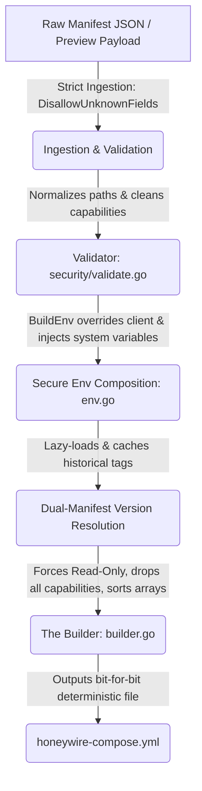

# Hub Secure Compose Compiler Architecture

The `internal/compose` package is responsible for compiling deterministic, hardened `honeywire-compose.yml` configurations served to remote edge nodes. 

To prevent privilege escalation or container escape vulnerabilities, the compiler operates on the principle of **Secure Defaults by Inversion**. Instead of attempt-filtering bad configurations out of an arbitrary map, the compiler explicitly maps specific allowed schema primitives into a locked-down, pre-configured Compose base.

---

## The Compilation Pipeline

### 1. Strict Ingestion
All API endpoints receiving compose preview payloads, as well as catalog fetch operations, ingest JSON using `json.NewDecoder` configured with `.DisallowUnknownFields()`. This establishes a hard boundary at the API layer: if a manifest or override payload contains attributes outside the schema, the request is immediately rejected before any compilation logic executes.

### 2. The Validator (`internal/compose/security/validate.go`)
The validation module acts as the security gateway for all manifests and user-provided configuration overrides. It performs:
* **Capability Restriction:** Enforces a strict allowlist of Linux capabilities (e.g. `NET_RAW`, `NET_BIND_SERVICE`, `NET_ADMIN`). Any other capabilities are blocked.
* **Volume Path Normalization:** Cleans host and container path structures (`filepath.Clean()`) and rejects paths matching a forbidden directory denylist (e.g., `/proc`, `/sys`, `/var/run/docker.sock`).
* **Safe Interpolation Checking:** Rejects common interpolation patterns (such as `${` or `{{`) on raw fields to block injection vectors, relying instead on structural builder templates.

### 3. Secure Environment Composition (`internal/compose/env.go`)
The environment generation pipeline merges variables with a strict priority order:
1. **Manifest Defaults:** Base variables defined in the sensor manifest.
2. **User/Node Overrides:** Safe environment variables requested via the UI or Wizard (ignoring any attempting to override forbidden system environment fields).
3. **System-Injected Constants:** Hardcoded, system-injected values (such as `HW_HUB_KEY`, `HW_SENSOR_ID`) that are unconditionally set by the Hub.

### 4. Versioning and Dual-Manifest Resolution
To support manual upgrades and historical rollbacks, nodes often run versions of a sensor other than the absolute latest catalog version. To prevent compiling incompatible or broken configurations, the compiler uses dual-manifest resolution:
* **Latest Catalog:** Warmed into cache on startup via the central `index.json`.
* **Historical Schemas:** Lazy-loaded and permanently cached via `FetchSpecificManifest` from the configured registry when a legacy node requests its deployed version. If a node is deployed with a legacy tag, the compose preview will render configurations specific to that historical manifest tag rather than defaulting to the newest catalog entry.

### 5. The Builder (`internal/compose/builder.go`)
The builder converts the strictly validated model inputs into a `ComposeFile` struct:
* **Immutable Sandboxing:** Unconditionally forces secure runtime defaults, including `ReadOnly: true`, `CapDrop: ["ALL"]`, and `SecurityOpt: ["no-new-privileges:true"]`.
* **Bit-for-Bit Determinism:** Output arrays (environment pairs, volume mount paths, initialization chains) are explicitly alphabetically sorted. This ensures that the generated YAML string is perfectly deterministic and predictable.
