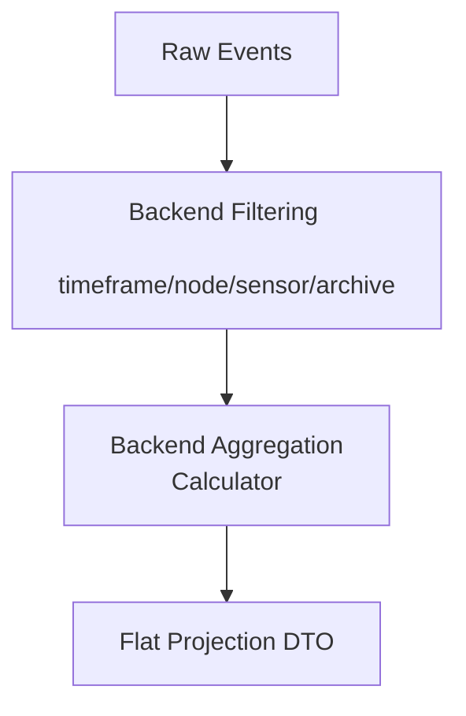

# Read-Models & Projections

To keep dashboard widgets fast and lightweight, the backend employs a CQRS-style (Command Query Responsibility Segregation) Read/Analytics Layer. This offloads all heavy processing, aggregation, and filtering from the frontend, ensuring it never has to traverse massive arrays of raw events.

## Architectural Goals

- **Backend Authority:** Eliminate frontend traversal of raw event arrays.
- **Contextual Filtering:** Push all filtering (timeframe, node, sensor, archive mode) to the database and projection builders.
- **Immutable Snapshots:** Serve pre-aggregated, flat data structures (DTOs) that represent an immutable analytics snapshot.
- **Lightweight UI:** Keep Vue components strictly rendering-focused.

## Projection Pipeline

The backend projection architecture operates in four distinct phases:



### Components

1. **DTO Layer (`dto.go`):** Defines the flat API contract returned to the frontend. There are no nested properties—only simple, primitive values (e.g., `Total`, `Critical`, `High`).
2. **Calculator Layer (`calculator.go`):** Contains pure aggregation logic. It iterates over the filtered events, performs counting, and returns the aggregated data. It has **no** database, HTTP, or frontend concerns.
3. **Projection Layer (`projection.go`):** Orchestrates the pipeline. It accepts filtering context, fetches the relevant subset of events from the storage layer, passes them to the calculator, and returns the composed DTO.
4. **API Handler (`analytics.go`):** A thin HTTP adapter that parses query parameters and invokes the projection builder.

## Example: Severity Analytics

The Severity Projection provides a comprehensive breakdown of event severities based on active filters.

### API Endpoint

`GET /api/v2/events/severity`

**Query Parameters:**
- `timeframe`: The time window (`alltime`, `24H`, etc.) (default: `alltime`)
- `node`: Filter by node ID (optional)
- `sensor`: Filter by sensor ID (optional)
- `viewingArchive`: Include archived events (`true` or `false`) (default: `false`)

**Example Response:**
```json
{
  "timeframe": "24H",
  "total": 150,
  "critical": 10,
  "high": 40,
  "medium": 50,
  "low": 30,
  "info": 20
}
```

## WebSocket Flow & Invalidation

To maintain real-time reactivity without frontend recomputation:

1. A new event triggers a WebSocket broadcast (`NEW_EVENT`).
2. The frontend Vue store receives the event and checks if it falls within the currently active filter context.
3. If relevant, the frontend simply **invalidates** the current projection and re-fetches `/api/v2/events/severity`.
4. The Vue Store replaces the snapshot reference, and the chart re-renders effortlessly.

This guarantees that the backend always remains the single source of truth for analytics.

## Example: Uptime Analytics

The Uptime Projection generates historical block-based availability matrices (similar to GitHub status charts) for sensors.

### Implementation Details
- **Discrete State Tracking:** Unlike previous architectures that scanned thousands of individual heartbeats, the engine strictly queries the `sensor_status_changes` table, calculating exact time deltas between `online` and `offline` states.
- **Strict Availability Threshold:** A time block is only labeled as `up` if its calculated availability is **≥ 99%**. Any downtime dropping a block below 99% marks it as `degraded` (or `down` if 0%).
- **First-Seen Alignment:** To prevent false `degraded` penalties during the gap between sensor registration and its initial heartbeat, the engine dynamically aligns the start of the first uptime block with the exact timestamp of the sensor's first `online` state change.

### API Endpoint

`GET /api/v2/uptime`

**Query Parameters:**
- `timeframe`: The time window (`1H`, `24H`, `7D`, `30D`) (default: `24H`)

**Example Response:**
```json
{
  "uptime_percentage": 100.0,
  "nodes": [
    {
      "node_id": "hw-node-1",
      "blocks": [
        {"status": "up", "label": "Online", "timeLabel": "23 hours ago"},
        {"status": "degraded", "label": "Degraded (98.5% uptime)", "timeLabel": "22 hours ago"}
      ]
    }
  ]
}
```
