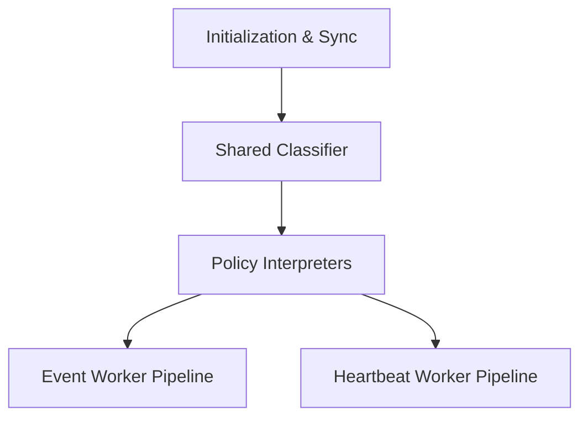

# Sensor Architecture Overview

## Purpose

Sensors are the decentralized execution layer of the HoneyWire platform. They are individual, containerized decoy applications placed throughout a network. 

Their core responsibilities are:
- Detecting malicious activity (generating telemetry and alerts)
- Emitting continuous health heartbeats
- Operating with total independence (no sensor-to-sensor communication)

To ensure consistency, resilience, and strict adherence to the [**HoneyWire Event Standard**](/Docs/architecture/dataContracts.md#1-the-universal-event-standard), all official sensors are built using HoneyWire's Language SDKs (available in Go and Python). This document outlines the architectural contract and behavior enforced by these SDKs.

---

## High-Level Architecture

The sensor architecture is built on a concurrent, multi-pipeline design that strictly separates domain rules (Policy) from network transport (Pipelines).

---

## 1. Initialization & Sync

Before a sensor begins monitoring, it must successfully establish a baseline with the Hub.

1. **Environment Validation:** The sensor strictly requires `HW_HUB_ENDPOINT`, `HW_HUB_KEY`, and `HW_SENSOR_ID` to be present.
2. **Version Synchronization (`syncHubVersion`):** The sensor performs a blocking handshake with the Hub (`GET /api/v2/version`). It retrieves the Hub's contract version. If the Hub's major version does not match the SDK's agent version, the sensor refuses to start.
3. **Pipeline Boot:** If successful, the SDK spins up the Event Loop and Heartbeat Loop as isolated background workers (Goroutines in Go, Daemon Threads in Python).

---

## 2. Shared Classifier (The Truth Layer)

The SDK utilizes a pure functional `classify` method. This layer evaluates raw HTTP results (or network errors) and returns a factual `ResponseFact` object. It contains **no behavioral logic**.

**Determines:**
- `IsError`: Was the request successful?
- `IsTransient`: Is this a network timeout, a 429 Rate Limit, or a 5xx error (meaning we should retry)? Or is it a 401/403/400 (meaning it's a fatal failure)?
- `RetryAfter`: Did the Hub explicitly request a backoff duration via HTTP headers?

---

## 3. Policy Interpreters (Domain Rules)

The Policy Engine interprets the `ResponseFact` and dictates the exact behavior the pipelines must follow.

### Event Policy
Governs the strict, ordered, retry-bounded queue for intrusion events.
- **SUCCESS:** The event was received.
- **RETRY:** A transient error occurred. The policy calculates a Jittered Exponential Backoff delay (or uses the Hub's `Retry-After` header).
- **DROP:** A terminal error occurred (e.g., Auth failure). The event is discarded to prevent infinite looping.

### Heartbeat Policy
Governs the stateless, lossy, continuous signal for node health.
- **OK State:** Wait the `BaseHeartbeatInterval` (30 seconds).
- **Degraded State (Transient):** Maintain the steady lossy pulse, unless the Hub explicitly provided a `Retry-After` header, in which case the sensor respects the Hub's requested breathing room.
- **Terminal State:** Enter a massive `TerminalSleepInterval` (1 hour) to prevent hammering a Hub that has actively rejected the sensor's credentials.

---

## 4. Runtime Pipelines

### Pipeline A: Event Worker
The Event Worker handles intrusion alerts. It prioritizes guaranteed delivery without blocking the main monitoring thread.

1. **Buffering:** When the sensor logic detects an intrusion, it calls `ReportEvent`. This pushes the payload into a bounded, non-blocking channel/queue (capacity: 1000). If the buffer is full, the event is immediately dropped to prevent out-of-memory crashes on the host.
2. **Execution:** The worker pulls events from the queue one by one.
3. **Retries:** It attempts delivery up to `MaxRetriesPerEvent` (7 times). If transient errors occur, it pauses processing using the delay calculated by the Event Policy. If the limit is reached, the event is dropped.

### Pipeline B: Heartbeat Worker
The Heartbeat Worker proves the sensor is alive.

1. **Stateless Pulse:** Every 30 seconds, it POSTs to `/api/v2/heartbeat` with its Sensor ID, Agent Version, and Contract Version.
2. **Lossy:** Unlike events, heartbeats are not queued or retried. If a heartbeat fails, the worker simply sleeps and tries again on the next tick.

---

## 5. Graceful Shutdown & Offline Signaling

When a sensor container receives a termination signal (SIGTERM):

1. **Stop Signal:** The SDK stops accepting new events into the buffer.
2. **Drain Queue:** The Event Worker attempts a best-effort, rapid flush of any remaining events in its buffer directly to the Hub.
3. **Offline Notification (`GoOffline`):** The sensor fires a final, fast-timeout POST to `/api/v2/offline` with the reason `graceful_shutdown`. This allows the Hub's UI to immediately mark the sensor as "Offline" rather than waiting 60 seconds for the heartbeat monitor to declare it "Down".