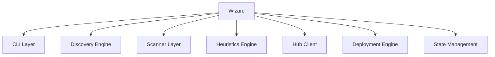
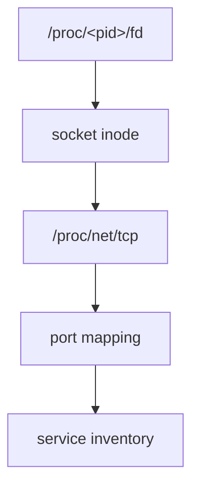
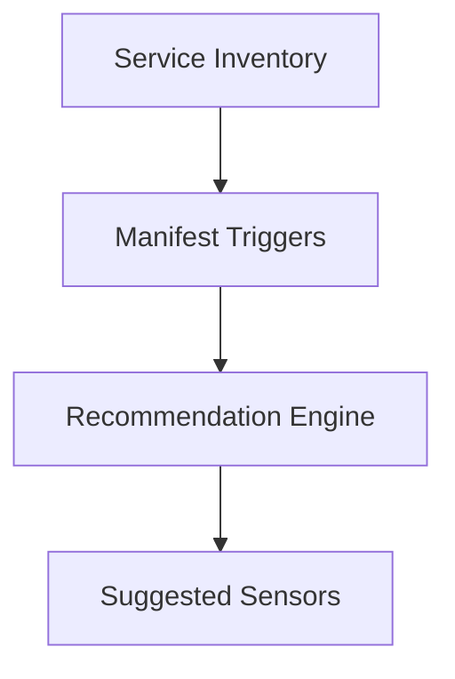
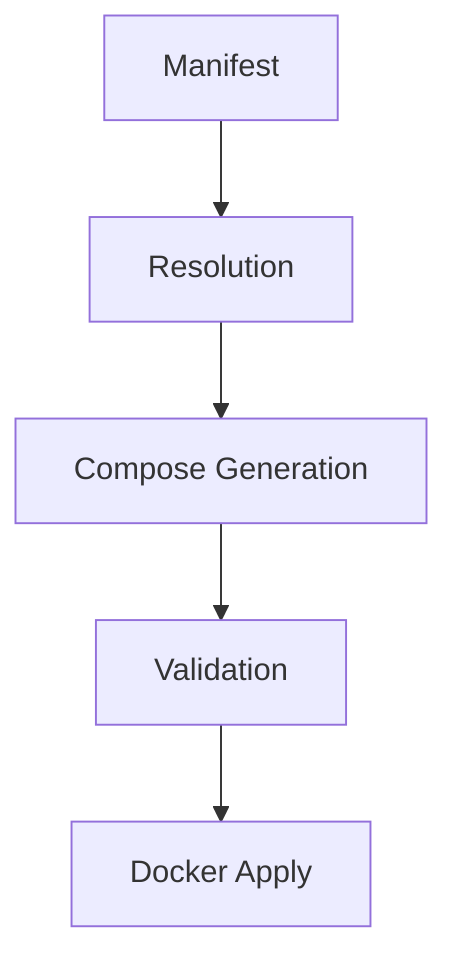
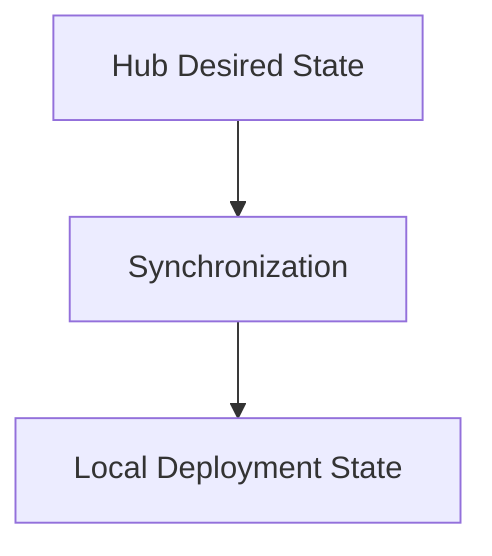
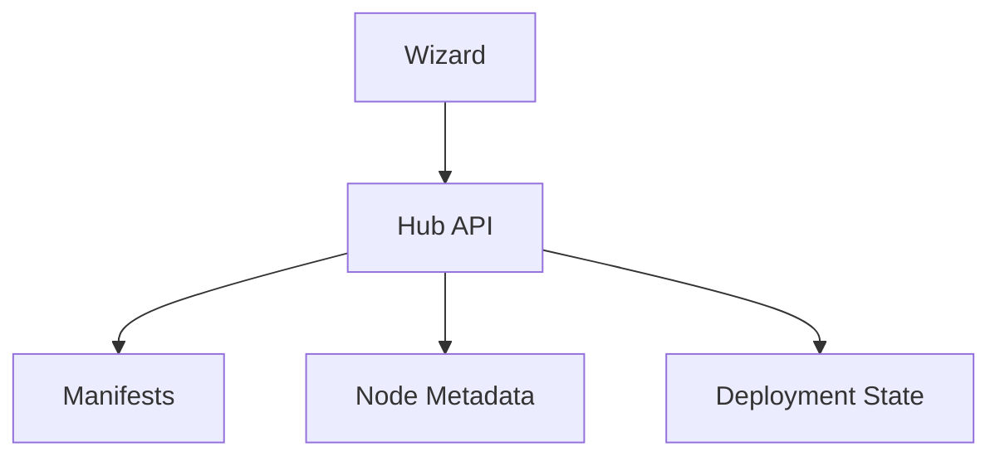
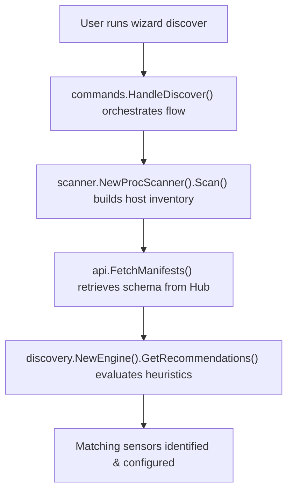
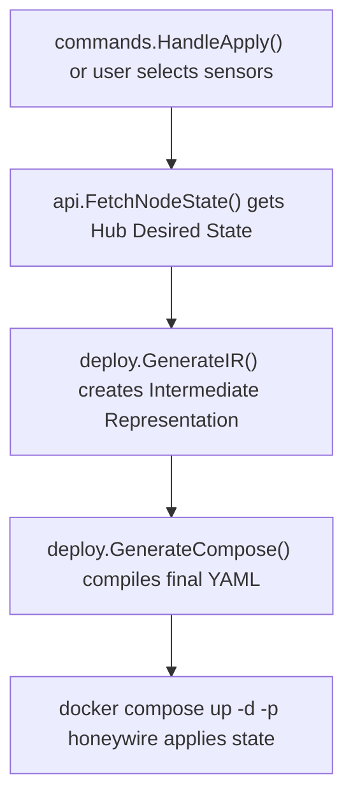
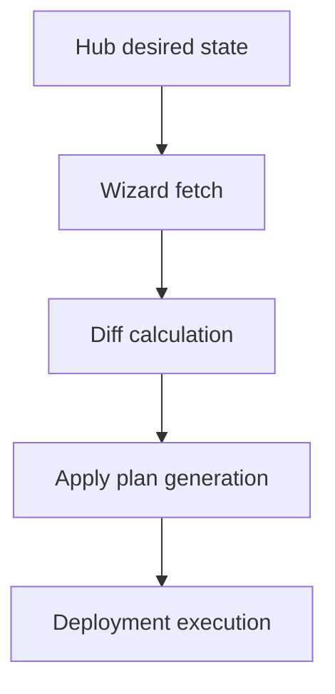

# Wizard Architecture Overview

## Purpose

The Wizard is HoneyWire's host-side orchestration engine.

Its responsibilities are:

- Host discovery
- Sensor recommendation
- Deployment planning
- State synchronization
- Sensor lifecycle management

The Wizard is designed as an **ephemeral administrative tool** rather than a persistent agent. This ensures that no long-running agent or daemon remains on the host after provisioning or synchronization tasks are completed.

---

## High-Level Architecture

The Wizard architecture separates runtime orchestration from platform domain logic.

### CLI Layer
Located in: `internal/cli` and `internal/commands`

**Responsibilities:**
- Command routing
- Interactive onboarding
- User prompts
- Output rendering
- Session flow

*Example Commands:* `wizard discover`, `wizard apply`, `wizard status`, `wizard uninstall`

### Discovery Engine
Located in: `core/discovery`

**Responsibilities:**
- Host inspection orchestration
- Scanner execution
- Sensor recommendation generation
- Service inventory construction

This is the coordinator. It does not inspect Linux itself; rather, it orchestrates the underlying scanners to construct an accurate view of the host's attack surface.

### Scanner Layer
Located in: `core/scanner`

**Responsibilities:**
- Process discovery
- Port discovery
- Service inventory generation

*Example inspection path:*

### Heuristics Engine

**Responsibilities:**
- Matches observed services against manifest-defined heuristics to generate contextual deception strategies.

Sensor recommendations are generated by matching observed services against manifest-defined heuristics. This ensures that the generated decoy deployment precisely mirrors the host's actual network profile, minimizing noise and increasing fidelity.

### Hub Client
Located in: `core/api`

**Responsibilities:**
- Fetches manifest data
- Interacts with the HoneyWire Hub for node linking
- Fetches and synchronizes node state

### Deployment Engine
Located in: `internal/deploy`

**Responsibilities:**
- Manifest resolution
- Compose file generation
- Container lifecycle management (start, stop, uninstall)

### State Management
Located in: `internal/app` and `internal/system`

**Responsibilities:**
- Local tracking of applied deployments
- Host readiness validation
- Handling state synchronization with the Hub

---

## Deployment Architecture

The deployment architecture defines how manifests are turned into running deception environments.

### Manifest Resolution
- Load manifests from the Hub
- Resolve templates
- Resolve environment variables
- Apply defaults

### Compose Generation
- Generate deployment Intermediate Representation (IR)
- Generate final Compose output

### Deployment Execution
- `docker compose pull`
- `docker compose up`
- Health verification

> uses specific `honeywire-compose.yml` file and `-p honeywire` flag under the hood to separate honeywire's deployment from existing services

---

## State Management

The Wizard is heavily hub-centric, treating the Hub as the source of truth.

Current deployment state is reconstructed from generated compose data and Docker daemon inspections, rather than maintained as a separate, fragile local database. The local state acts strictly as an execution representation of the Hub's desired state.

---

## Hub Integration

The Wizard acts as the execution layer. The Hub acts as the control plane.

---

## Runtime Data Flows

### Discovery Flow

### Deployment Flow

### Synchronization Flow

---

## Design Principles

### Agentless Operation
The Wizard performs administrative actions and deployments without installing a persistent host agent. Once it runs, it exits.

### Manifest-Driven Deployment
Deployment behavior is defined entirely through sensor manifests. The Wizard contains no hardcoded sensor behavior, making the platform easily extensible.

### Host-Aware Discovery
Recommendations are generated from live host inspection (via `/proc` and sockets) rather than static profiles or generic assumptions.

### Declarative Synchronization
The Hub defines the desired state. The Wizard reconciles local deployments toward that state.
