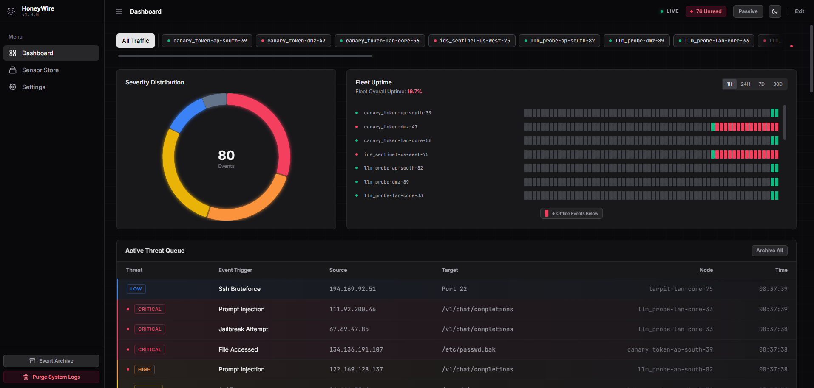
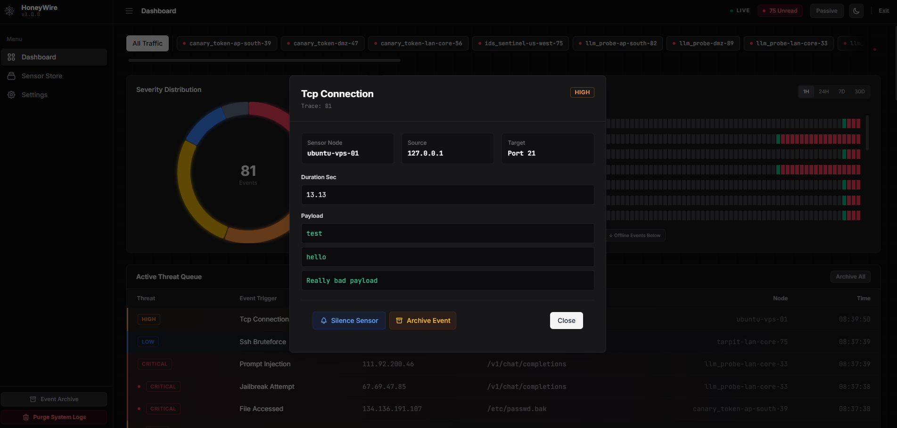

  [](LICENSE)
  []()

## 📋 Table of Contents
- [Overview](#-honeywire)
- [Screenshots](#screenshots)
- [The Universal Event Standard](#-the-universal-event-standard-bring-your-own-sensor)
- [Features](#-features)
- [Architecture](#%EF%B8%8F-architecture)
- [Quick Start Guide](#-quick-start-guide)
- [Testing the Trap](#-testing-the-trap)
- [Security Notes](#%EF%B8%8F-security-notes)
- [Tech Stack](#%EF%B8%8F-tech-stack)
- [Versioning and API Reference](#-versioning-and-api-reference)
- [Operational Checklist](#-operational-checklist)

---

# HoneyWire

**HoneyWire Sentinel** is a lightweight, distributed deception hub and Micro-SIEM. It is designed to deploy silent, asynchronous sensors that can act as traps or lures, across multiple servers that detect unauthorized access, trap automated botnets, and report telemetry back to a centralized dashboard in real-time.

Developed in collaboration with Gemini (Google AI). 
Architected by Termine Andrea, implementation and boilerplate assisted by LLM.

There are existing lightweight SIEM/Deception Hubs, but none feature a clean, SaaS-grade dashboard with instant webhooks, and the ones that do are incredibly resource-intensive. This project aims at filling that gap in the cybersecurity software and tools landscape for hobbyists.

---

## Screenshots

### Main Dashboard


### Payload Inspector


---
## 🔌 The Universal Event Standard (Bring Your Own Sensor)

** [Community Sensors](./Sensors/community/) **

The true power of HoneyWire is that the Hub is **completely sensor-agnostic**. You are not limited to the included official sensors. 

By adhering to the **HoneyWire Event Standard V1.0**, you can write a script in *any* language (Bash, Go, Rust, Python) to monitor *anything*, and the Sentinel UI will dynamically parse, syntax-highlight, and render your forensic data. 

Whether it is a **Deep Packet Inspection (DPI)** engine, a **DNS sinkhole**, a **Canary Token** embedded in a PDF, an **Email Honeypot**, or a simple **TCP Port Tripwire**, just POST this JSON to the Hub:

```json
{
  "contract_version": "1.0",
  "sensor_id": "core-dpi-engine",
  "sensor_type": "deep_packet_inspection",
  "event_type": "malformed_jwt_detected",
  "severity": "critical",
  "timestamp": "2026-04-03T11:30:00Z",
  "action_taken": "ip_banned",
  "metadata": {
    "source_ip": "104.28.19.12",
    "target": "Auth Gateway",
    "protocol": "TCP",
    "headers_stripped": true,
    "payload_sample": [
      "Authorization: Bearer eyJhbG... [TRUNCATED]",
      "User-Agent: curl/7.64.1"
    ]
  }
}
```
> Note: If you build your sensor using the official HoneyWire Python SDK, this JSON formatting and delivery is handled for you automatically!

*The Hub's Alpine.js frontend will automatically translate arrays into syntax-highlighted code blocks and primitive values into clean metadata tags.*

---

## Features

- **The Sentinel UI:** A fully responsive dashboard featuring Dark/Light mode, real-time Chart.js threat distribution, and dynamic forensic payload inspection.
- **Included tripwire Sensor:** A Python tripwire capable of handling concurrent connections with semantic logging to prevent file descriptor exhaustion.
  - **Three Tarpit Modes:**
    - `hold`: Keeps connections open indefinitely to waste attacker resources.
    - `echo`: Bounces malicious payloads back to the sender.
    - `close`: Terminates connections immediately after logging the IP.
  - **Service Spoofing:** Customizable banners to impersonate legitimate services (e.g., OpenSSH, vsFTPd).
  - **Instant Notifications:** Built-in support for ntfy.sh and Gotify mobile alerts.

---

## Architecture

HoneyWire is split into two independent microservices:

1. `/Hub`: The central brain. It runs a FastAPI backend, an SQLite database, and the web dashboard. It runs as a nonroot user inside a Distroless container, safely mounting data to a dedicated volume.
2. `/Sensors`: The decoy nodes (like the included TCP Tripwire or your custom scripts). They listen on vulnerable ports, trap attackers, and securely POST intrusion data back to the Hub.
3. `/SDKs`: Official libraries (like python-honeywire) that handle secure Hub communication so community developers can easily build new sensors.

---

## 🚀 Quick Start Guide

Deploying HoneyWire takes less than 60 seconds using our pre-built GitHub Container images. No compiling required.

Create a new directory on your server, and create two files: `docker-compose.yml` and `.env`.

### 1. The `docker-compose.yml`

```yaml
services:
  hub:
    image: ghcr.io/andreicscs/honeywire-hub:latest
    container_name: honeywire-hub
    restart: unless-stopped
    ports:
      - "8080:8080"
    volumes:
      - honeywire_data:/data
    env_file: 
      - .env

  tcp-tripwire:
    image: ghcr.io/andreicscs/honeywire-tcptripwire:latest
    container_name: hw-tcp-tripwire
    restart: unless-stopped
    network_mode: "host" # Required to accurately capture port scans against the physical machine
    env_file: 
      - .env

volumes:
  honeywire_data:
```
### 2. The .env Configuration
```
# ==========================================
# HUB CONFIGURATION
# ==========================================
# The master password for your fleet to communicate
HW_HUB_KEY=super_secret_key_123

# Protect your Web UI (Leave blank for no password)
HW_DASHBOARD_PASSWORD=my_secure_password

# Optional: Push Notifications
HW_NTFY_URL=[https://ntfy.sh/your_private_topic](https://ntfy.sh/your_private_topic)
HW_GOTIFY_URL=[https://gotify.yourdomain.com/message](https://gotify.yourdomain.com/message)
HW_GOTIFY_TOKEN=your_app_token


# ==========================================
# TRIPWIRE SENSOR CONFIGURATION
# ==========================================
# Point this to your Hub's IP address and Port
HW_HUB_ENDPOINT=[http://127.0.0.1:8080](http://127.0.0.1:8080)

# Identify this specific sensor
HW_SENSOR_ID=node-01

# A comma-separated list of fake ports to open
HW_DECOY_PORTS=21,22,2222,3306,8080

# Tarpit Behavior: 'hold', 'echo', or 'close'
HW_TARPIT_MODE=hold

# UI Color Coding: info|low|medium|high|critical
HW_SEVERITY=high

# Fake Service Banner (Use \r\n for line breaks)
HW_TARPIT_BANNER=SSH-2.0-OpenSSH_8.2p1 Ubuntu-4ubuntu0.1\r\n
```
### 3. Start the Trap
Run the following command to pull the images and start the honeypot:
```Bash
docker compose up -d
```
Access the dashboard at http://localhost:8080 (or your server's IP).

---

## 🧪 Testing the Trap

Once both containers are running, check your Hub dashboard. The Agent should appear in the **Fleet Health** bar as `ONLINE` within 30 seconds.

To simulate an attack, use `netcat` to connect to one of your decoy ports:
```bash
nc <tripwire-ip> 2222
```
1. If your mode is hold or echo, you will immediately see your fake TARPIT_BANNER.
2. Type a fake exploit payload (e.g., admin).
3. Notice the tarpit delay (or indefinite hold) as it traps your connection.
4. Press Ctrl+C to drop the connection.
5. Watch the alert and payloads instantly appear on your HoneyWire dashboard and notification pushed to your phone!

---

## 🛡️ Security Notes
* **API Secret:** Ensure your `API_SECRET` is strong and identical on both the Hub and the Agents. The Hub will reject any payloads with mismatched keys.
* **System Arming:** You can toggle the "System Armed" button in the Hub UI to temporarily disable push notifications while doing internal network maintenance or vulnerability scanning.
* **Container Hardening:** HoneyWire utilizes gcr.io/distroless/python3-debian12. Do not attempt to use docker exec -it honeywire-agent sh as there is no shell binary included in the image by design.
* **Distributed Deployment:** It is highly recommended to run the Hub and its Sensors on separate physical or virtual machines. If an attacker compromises a sensor node, they should not have immediate local access to the centralized Hub.
* **Encryption (HTTPS):** Always serve the Hub Web GUI and API over HTTPS. Failure to do so exposes your API_SECRET and DASHBOARD_PASSWORD to anyone sniffing the network.

## Tech Stack
* **Backend:** Python 3.11, FastAPI, SQLite3, Asyncio
* **Frontend:** HTML5, TailwindCSS, Alpine.js, Chart.js
* **Infrastructure:** Docker, Docker Compose, Distroless Linux

---

## Versioning and API reference

- HoneyWire now uses a single source of truth version file: `VERSION` in the repo root.
- Runtime version is exposed via env override: HW_VERSION (Hub + Sensors), and defaults to VERSION.
- `Hub` endpoint:
  - `GET /api/v1/version` → returns `{ "version": "1.0.0" }`
- API docs file added: [📖 API.md](./Docs/API.md). with full backend route reference and sample payloads.

### API endpoints to know
- `GET /api/v1/system/state` / `PATCH /api/v1/system/state`
- `GET /api/v1/sensors`
- `GET /api/v1/events`
- `PATCH /api/v1/events/read`, `PATCH /api/v1/events/{event_id}/read`, `DELETE /api/v1/events`
- `POST /api/v1/heartbeat` (Sensor heartbeat)
- `POST /api/v1/event` (Sensor event reports)

---

## Operational checklist
- set `HW_HUB_KEY` for all components
- set optional `HW_DASHBOARD_PASSWORD`
- build/redeploy containers after any version bump in `VERSION` or env value
