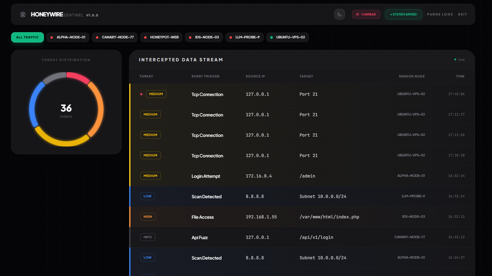
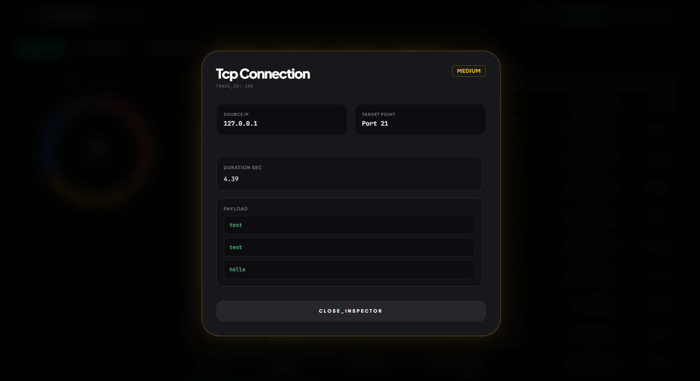

[](LICENSE)

# 🕸️ HoneyWire

**HoneyWire** is an ultra-lightweight, distributed micro-honeypot and command center. It is designed to deploy silent, asynchronous "tarpit" sensors across multiple servers that detect unauthorized scans, trap automated botnets, and report telemetry back to a centralized dashboard in real-time.

Developed in collaboration with Gemini (Google AI). 
Architected by Termine Andrea, implementation and boilerplate assisted by LLM.

There already exist lightweight honeypots but none had a simple clean dashboard with webhook notification integrations, and the ones that do are incredibly resource intensive. This project aims at filling that gap in the cybersecurity software and tools landscape for hobbyists.

---

## Screenshots

### Main Dashboard


### Payload Inspector


---

## Features

- **Connection trapping:** Python asyncio manages thousands of concurrent connections with three response modes:
  - `hold`: Keeps connections open indefinitely
  - `echo`: Returns payloads to the sender
  - `close`: Terminates connections immediately after logging
- **Service spoofing:** Customizable banners to impersonate legitimate services (e.g., OpenSSH, vsFTPd)
- **Distributed architecture:** Hub-and-spoke model with central hub on internal networks and agents on public-facing instances
- **Dashboard security:** Optional password protection via encrypted cookies (30-day expiry)
- **Notifications:** Built-in support for ntfy.sh and Gotify mobile alerts
- **Container security:** Multi-stage distroless images with rootless hub and agent containers lacking shell access

---

## 🏗️ Architecture

HoneyWire is split into two independent microservices:

1. **The Hub (`/Hub`)**: The central brain. It runs a FastAPI backend, an SQLite database, and the web dashboard. It runs as a `nonroot` user inside a Distroless container, safely mounting data to a dedicated volume.
2. **The Agent (`/Agent`)**: The decoy sensor. It listens on vulnerable ports, traps attackers, and securely POSTs the intrusion data back to the Hub.

---

## 🚀 Quick Start Guide

Deploying HoneyWire takes less than 60 seconds using our pre-built GitHub Container Registry images. No compiling required.

Create a new directory on your server, and create two files: `docker-compose.yml` and `.env`.

### 1. The `docker-compose.yml`

```yaml
services:
  hub:
    image: ghcr.io/andreicscs/honeywire-hub:latest
    container_name: honeywire-hub
    restart: unless-stopped
    ports:
      - "8080:8080"
    volumes:
      - honeywire_data:/data
    env_file: 
      - .env

  agent:
    image: ghcr.io/andreicscs/honeywire-agent:latest
    container_name: honeywire-agent
    restart: unless-stopped
    network_mode: "host" # Required to accurately capture port scans against the physical machine
    env_file: 
      - .env

volumes:
  honeywire_data:
```
### 2. The .env Configuration
```
# ==========================================
# HUB CONFIGURATION
# ==========================================
# The master password for your fleet to communicate
API_SECRET=super_secret_key_123

# Protect your Web UI (Leave blank for no password)
DASHBOARD_PASSWORD=my_secure_password

# Optional: Push Notifications
NTFY_URL=https://ntfy.sh/your_private_topic
GOTIFY_URL=https://gotify.yourdomain.com/message
GOTIFY_TOKEN=your_app_token
```
```
# ==========================================
# AGENT CONFIGURATION
# ==========================================
# Point this to your Hub's IP address and Port
HUB_URL=http://127.0.0.1:8080

# Must match the Hub's secret
API_SECRET=super_secret_key_123

# Identify this specific sensor and its IP
SENSOR_ID=dmz-node-01
SENSOR_IP=192.168.1.50

# A comma-separated list of fake ports to open
DECOY_PORTS=21,22,2222,3306,8080

# Tarpit Behavior: 'hold', 'echo', or 'close'
TARPIT_MODE=hold

# Fake Service Banner (Use \r\n for line breaks)
# Example SSH: SSH-2.0-OpenSSH_8.2p1 Ubuntu-4ubuntu0.1\r\n
# Example FTP: 220 (vsFTPd 3.0.3)\r\n
TARPIT_BANNER=SSH-2.0-OpenSSH_8.2p1 Ubuntu-4ubuntu0.1\r\n
```
### 3. Start the Trap
Run the following command to pull the images and start the honeypot:
```Bash
docker compose up -d
```
Access the dashboard at http://localhost:8080 (or your server's IP).

---

## 🧪 Testing the Trap

Once both containers are running, check your Hub dashboard. The Agent should appear in the **Fleet Health** bar as `ONLINE` within 30 seconds.

To simulate an attack, use `netcat` to connect to one of your decoy ports:
```bash
nc <agent-ip> 2222
```
1. If your mode is hold or echo, you will immediately see your fake TARPIT_BANNER.
2. Type a fake exploit payload (e.g., admin).
3. Notice the tarpit delay (or infinite hold) as it traps your connection.
4. Press Ctrl+C to drop the connection.
5. Watch the alert and payload instantly appear on your HoneyWire dashboard and notification pushed to your phone!

---

## 🛡️ Security Notes
* **API Secret:** Ensure your `API_SECRET` is strong and identical on both the Hub and the Agents. The Hub will reject any payloads with mismatched keys.
* **System Arming:** You can toggle the "System Armed" button in the Hub UI to temporarily disable push notifications while doing internal network maintenance or vulnerability scanning.
* **Container Hardening:** HoneyWire utilizes gcr.io/distroless/python3-debian12. Do not attempt to use docker exec -it honeywire-agent sh as there is no shell binary included in the image by design.

## 🛠️ Tech Stack
* **Backend:** Python 3.11, FastAPI, SQLite3, Asyncio
* **Frontend:** HTML5, TailwindCSS, Alpine.js, Chart.js
* **Infrastructure:** Docker, Docker Compose, Alpine Linux
