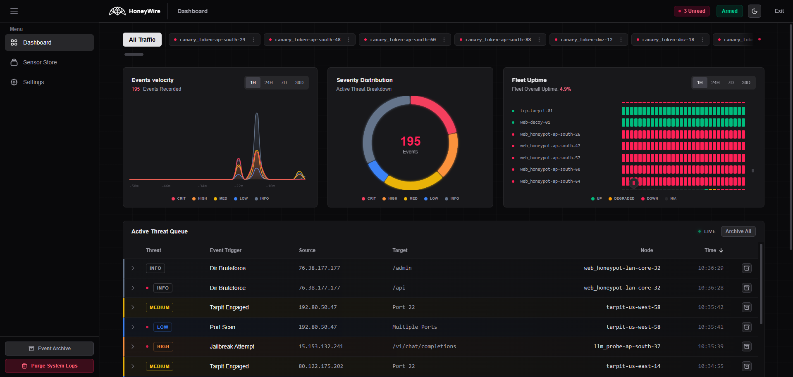
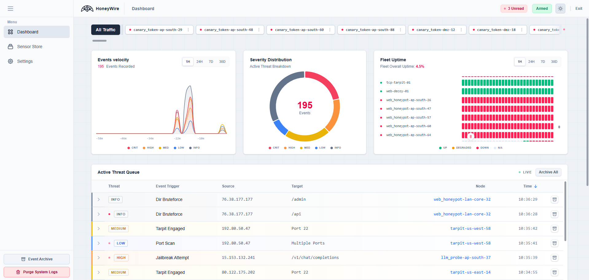

[](LICENSE)

## 📋 Table of Contents
- [Overview](#honeywire)
- [Screenshots](#screenshots)
- [The Universal Event Standard](#-the-universal-event-standard-bring-your-own-sensor)
- [Features](#features)
- [Architecture](#architecture)
- [Quick Start Guide](#-quick-start-guide)
- [Security Notes](#security-notes)
- [Tech Stack](#tech-stack)
- [Versioning and API Reference](#versioning-and-api-reference)
- [Operational Checklist](#operational-checklist)

---
# HoneyWire

**HoneyWire Sentinel** is a lightweight, Distributed High-Signal Security Early-Warning System, designed for internal networks. It replaces the "magnifying glass" approach of traditional SIEMs, which often drown analysts in false positives by surveilling legitimate traffic, with a High-Fidelity Tripwire model. 

Place a sensor exactly where you want it. If it trips, you have an intruder.
  - **Production Tripwires**: Sound the alarm when active services are being poked in ways they shouldn't be. By placing a sensor on a sensitive file that should never be read or a service port that should never be accessed, you identify intruders by their deviation from the "authorized path."
  - **Synthetic Deception**: Deploy lures like the [ICMP Canary](./Sensors/official/IcmpCanary/) or [Network Scan Detector](./Sensors/official/NetworkScanDetector/) to act as decoys. Since these sensors provide no legitimate business value, 100% of their traffic is actionable intelligence.

Set up multiple and you start to have a pretty clear idea of the lateral movement of an intruder. No tuning, no noise, just instant forensics.

---

## Screenshots

### Main Dashboard




---
## 🔌 The Universal Event Standard (Bring Your Own Sensor)

[**Community Sensors**](./Sensors/community/)

The true power of HoneyWire is that the Hub is **completely sensor-agnostic**. You are not limited to the included official sensors. 

By adhering to the **HoneyWire Event Standard V1.0**, you can write a script in *any* language (Bash, Go, Rust, Python) to monitor *anything*, and the Sentinel UI will dynamically parse, syntax-highlight, and render your forensic data. 

Whether it is a **Deep Packet Inspection (DPI)** engine, a **DNS sinkhole**, a **Canary Token** embedded in a PDF, an **Email Honeypot**, or a simple **TCP Port Tripwire**, just POST this JSON to the Hub:

```json
{
  "contract_version": "1.0",
  "severity": "critical",
  "event_trigger": "malformed_jwt_detected",
  "source": "104.28.19.12",
  "target": "Auth Gateway",
  "sensor_id": "core-dpi-engine",  
  "details": {
    "protocol": "TCP",
    "headers_stripped": true,
    "payload_sample": [
      "Authorization: Bearer eyJhbG... [TRUNCATED]",
      "User-Agent: curl/7.64.1"
    ]
  }
}
```
> Note: If you build your sensor using the official HoneyWire Go SDK, this JSON formatting and delivery is handled for you automatically.

*The Hub's frontend automatically translates arrays into syntax-highlighted code blocks and primitive values into clean detail tags.*

## Features

- **The Sentinel Hub UI:** A fully responsive, Vue 3-powered dashboard featuring Dark/Light mode, live WebSocket event streaming, and dynamic forensic payload inspection.
- **In-Browser Configuration:** Manage Master Passwords, Hub API Keys, Data Retention policies, and Webhooks directly from the UI. No need to touch `.env` files or restart containers to update alert targets.
- **Universal Push Notifications:** Native, zero-dependency integration for routing critical alerts to **Discord, Slack, Ntfy, and Gotify**.
- **Suite of Official Sensors:** Includes native [TCP Tarpit](./Sensors/official/TcpTarpit/), [Web Router Decoy](./Sensors/official/WebRouterDecoy/), [File Canary (FIM)](./Sensors/official/FileCanary/), [ICMP Canary](./Sensors/official/IcmpCanary/), and [Network Scan Detector](./Sensors/official/NetworkScanDetector/).

---

## Architecture

HoneyWire is split into three independent microservices:

1. `/Hub`: The central brain. A pure Go binary running an embedded SQLite database and the Vue.js dashboard. It runs as a non-root user inside a Distroless container, safely mounting data to a dedicated volume.
2. `/Sensors`: The decoy nodes. Statically-linked Go binaries that listen on vulnerable ports, trap attackers, and securely POST intrusion data back to the Hub.
3. `/SDKs`: Official libraries (like `sdk-go`) that handle secure Hub communication so community developers can easily build new sensors.

---

## 🚀 Quick Start Guide

Deploying the HoneyWire Hub takes less than 60 seconds using our pre-built GitHub Container images. No compiling is required.

### 1. Deploy the Hub
Create a new directory on your server, create a `docker-compose.yml` file, and paste the following:

```yaml
services:
  # 1. THE PERMISSION FIXER: Runs once to ensure the Hub can write to the data volume
  permission-fixer:
    image: alpine:latest
    command: sh -c "chown -R 65532:65532 /data"
    volumes:
      - ./honeywire_data:/data

  # 2. THE HUB: The central Go-based dashboard and API
  hub:
    image: ghcr.io/andreicscs/honeywire-hub:latest
    container_name: honeywire-hub
    restart: unless-stopped
    ports:
      # Change 8080 to whatever port you prefer
      - "8080:8080"
    volumes:
      - ./honeywire_data:/data
    depends_on:
      permission-fixer:
        condition: service_completed_successfully
    
    # Strict Security Sandbox
    user: "65532:65532"
    read_only: true
    cap_drop: ["ALL"]
    security_opt: ["no-new-privileges:true"]
    
    environment:
      - HW_PORT=8080
      # Optional: Hardcode the dashboard password (disables the UI password reset feature)
      # - HW_DASHBOARD_PASSWORD=admin
```

Start the Hub:
```bash
docker compose up -d
```

### 2. Initialize the System
Navigate to `http://<your-server-ip>:8080` in your browser. You will be greeted by the **Initialize Sentinel** screen.
1. Create your Master Password.
2. Verify your Hub Endpoint URL (the IP/URL where sensors will reach the Hub).
3. Generate your secure Sensor Secret Key.
4. Click "Initialize Hub".

### 3. Deploy Sensors
Inside the Dashboard, navigate to the **Sensor Store**. Click on any sensor (e.g., the TCP Tarpit) to view its documentation. The Hub will automatically generate a ready-to-use `docker-compose.yml` script pre-filled with your Hub's IP and API Key. Copy that script, drop it on your target machine, and run `docker compose up -d`!


### 4. Testing the Trap

Once your containers are up, the Tarpit sensor should appear as `ONLINE` in the **Fleet Health** section of the dashboard within 30 seconds.

If you deployed the TcpTarpit sensor, to verify the detection loop, use `netcat` from a different machine (or a different terminal) to trigger the decoy:

```bash
# Connect to your decoy port (e.g., 2222) at localhost (or your server's IP).
nc localhost 2222
```

1. **Observe the Lure:** If `HW_TARPIT_MODE` is set to `hold` or `echo`, you will see your fake service banner immediately.
2. **Interact:** The connection will be intentionally stalled (Tarpit). Type a string (e.g., `admin` or `exploit_payload`) and press Enter.
3. **Close:** Press `Ctrl+C` to terminate the test connection.
4. **Verify Capture:**
   - Check the HoneyWire Dashboard; the event, your Source IP, and the payload will appear instantly.
   - If configured, you will receive a push notification on your mobile device.


---

## Security Notes
* **API Secret:** Ensure your `HW_HUB_KEY` is strong and identical on both the Hub and the Sensors. The Hub will reject any payloads with mismatched keys.
* **System Arming:** You can toggle the "System Armed" button in the Hub UI to temporarily disable push notifications while doing internal network maintenance or vulnerability scanning.
* **Container Hardening:** HoneyWire utilizes `gcr.io/distroless/static-debian12:nonroot`. We follow the principle of least privilege to make sure that if a container is compromised, the blast is contained.
* **Distributed Deployment:** It is highly recommended to run the Hub and its Sensors on separate physical or virtual machines. If an attacker compromises a sensor node, they should not have immediate local access to the centralized Hub.
* ⚠️ **Encryption (HTTPS):** Always serve the Hub Web GUI and API over HTTPS using a reverse proxy (like Nginx, Caddy, or Traefik) in production. Failure to do so exposes your `HW_HUB_KEY` and Dashboard password to network sniffing.
---

## Tech Stack
* **Backend:** Go 1.25, `net/http` (Standard Library), SQLite (ModernC Pure Go Driver)
* **Frontend:** Vue 3 (Composition API), TailwindCSS, Chart.js
* **Infrastructure:** Docker, Docker Compose, Distroless Linux Sandbox
---

## Versioning and API Reference

- HoneyWire uses a single source of truth version file: `VERSION` in the repo root.
- The runtime version is exposed via an env override: `HW_VERSION` (Hub + Sensors), which defaults to `VERSION`.
- `Hub` endpoint:
  - `GET /api/v1/version` → returns `{ "version": "1.0.0" }`
- API docs file: [📖 API.md](./Docs/API.md) with full backend route reference and sample payloads.

---

## Operational Checklist
- [x] Complete the Web UI Initial Setup to set the Master Password.
- [x] Retrieve the generated `HW_HUB_KEY` from Settings and apply it to your sensors.
- [x] Configure your push notification webhooks via the Settings UI.
- [x] Rebuild/redeploy containers after any version bump in `VERSION` or environment variable changes.